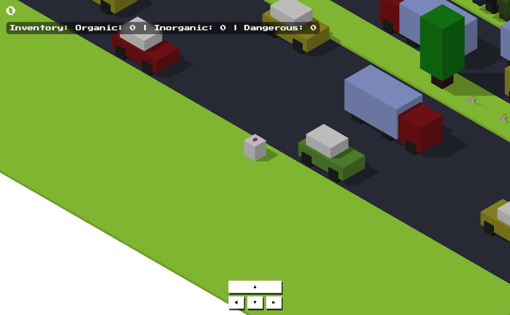

# Cross and Recycle 🚮♻️



A recycling-themed adaptation of the classic Crossy Road game. Navigate through traffic, collect different types of trash, and sort them into the correct recycling bins in this 3D educational game built with Three.js.

## Game Features 🎮

- **3D Environment**: Isometric view with cars, trees, roads, and grass tiles
- **Trash Collection**: Pick up different types of trash (organic, inorganic, dangerous)
- **Recycling Bins**: Sort collected trash into appropriate bins
- **Traffic Navigation**: Avoid moving vehicles while collecting trash
- **Score System**: Earn points for proper waste sorting
- **Educational Pop-ups**: Learn about different types of waste when picked up

## Controls 🕹️

### Movement
- **Arrow Keys** or **On-screen buttons**: Move the player
  - ▲ Forward
  - ▼ Backward
  - ◀ Left
  - ▶ Right

### Trash Deposit
When near a recycling bin, choose which trash to deposit:
- **O** - Deposit Organic trash
- **I** - Deposit Inorganic trash
- **D** - Deposit Dangerous trash
- **ESC** - Cancel deposit

## Installation 📦

1. Clone the repository
```bash
git clone https://github.com/miguroi/cross-and-recycle
cd cross-and-recycle
```

2. Install dependencies
```bash
bun install
```

## Development 🛠️

Start the development server:
```bash
bun run dev
```

Build for production:
```bash
bun run build
```

Preview production build:
```bash
bun run preview
```

## Game Mechanics 🎯

1. **Objective**: Collect trash from the map and sort it into the correct recycling bins
2. **Movement**: Navigate through roads and avoid traffic
3. **Collection**: Walk over trash items to automatically pick them up
4. **Sorting**: Approach recycling bins and deposit the correct trash type
5. **Scoring**: Earn points for properly sorted waste

## Tech Stack ⚙️

- **Three.js** - 3D graphics engine
- **Vite** - Build tool and development server
- **JavaScript ES6+** - Game logic and interactions
- **CSS** - Styling for UI elements

## Project Structure 📁

```
src/
├── components/         # 3D object components
│   ├── Player.js       # Player character and movement
│   ├── Map.js          # Game world generation
│   ├── Trash.js        # Trash items
│   ├── Bin.js          # Recycling bins
│   ├── Car.js          # Traffic vehicles
│   └── ...
├── utilities/          # Helper functions
├── animatePlayer.js    # Player animation logic
├── animateVehicles.js  # Vehicle movement
├── hitTest.js          # Collision detection
├── collectUserInput.js # Input handling
└── main.js             # Game initialization
```

## Getting Started 🚀

1. Start the development server
2. Open your browser to the local development URL
3. Use arrow keys or on-screen controls to move
4. Collect trash items by walking over them
5. Approach recycling bins and deposit trash using keyboard shortcuts
6. Try to achieve the highest score possible!

Have fun playing and learning about recycling! ♻️
